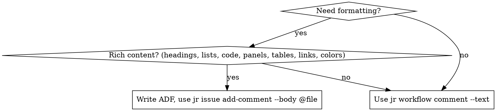

# ADF — Atlassian Document Format

Jira Cloud REST v3 stores rich content (comments, issue descriptions, wiki fields) as an **ADF JSON document** — a tree of typed nodes. **Markdown (`**bold**`, `- item`, `# h1`) and wiki markup (`*bold*`, `h1.`) are NOT parsed by the API** — they render as literal characters. For any formatting beyond a single plain-text paragraph, you must hand-author ADF.

## Envelope

Every ADF document has this outer shape:

```json
{
  "body": {
    "type": "doc",
    "version": 1,
    "content": [
      /* block-level nodes go here */
    ]
  }
}
```

For the `jr issue add-comment` command, the `body` wrapper is part of the request payload:

```bash
jr issue add-comment --issueIdOrKey PROJ-1 --body @comment.adf.json
```

Multi-node documents are painful to shell-escape — prefer `--body @file.json` or `--body -` (stdin).

## Block-level nodes

Block nodes live in `doc.content` (and in some container nodes like `listItem`, `panel`, `blockquote`, `tableCell`).

| Node | Attrs | Notes |
|------|-------|-------|
| `paragraph` | — | Most common block. Contains inline nodes. |
| `heading` | `level` 1–6 | `attrs: {"level": 2}` |
| `bulletList` | — | Contains `listItem` children only. |
| `orderedList` | `order` (optional start #) | Contains `listItem` children only. |
| `listItem` | — | Contains block nodes (usually a `paragraph`). |
| `taskList` | `localId` | Contains `taskItem` children. ⚠ site-edition dependent. |
| `taskItem` | `localId`, `state`: `TODO` \| `DONE` | Contains inline nodes. |
| `blockquote` | — | Contains block nodes. |
| `codeBlock` | `language` (optional: `bash`, `python`, `json`, ...) | Content: single `text` node (no marks). |
| `panel` | `panelType`: `info` \| `warning` \| `success` \| `error` \| `note` | Colored callout box. |
| `rule` | — | Horizontal divider. No content. |
| `table` | `isNumberColumnEnabled`, `layout` | Contains `tableRow` children. |
| `tableRow` | — | Contains `tableHeader` / `tableCell`. |
| `tableHeader` | `colspan`, `rowspan`, `background` | Contains block nodes. |
| `tableCell` | `colspan`, `rowspan`, `background` | Contains block nodes. |
| `expand` | `title` | Collapsible section. ⚠ site-edition dependent. |
| `mediaSingle` | `layout`, `width` | Embedded image/file (requires media ID). |

## Inline nodes

Inline nodes live in the `content` array of most block nodes.

| Node | Attrs | Notes |
|------|-------|-------|
| `text` | — (but takes `marks`) | The workhorse — all visible text. |
| `hardBreak` | — | Line break within a paragraph. |
| `mention` | `id` (accountId), `text` (display) | @mentions a user. |
| `emoji` | `shortName` (e.g. `:smile:`), `id`, `text` | Inline emoji. |
| `status` | `text`, `color`: `neutral` \| `purple` \| `blue` \| `red` \| `yellow` \| `green` | Inline status lozenge. ⚠ site-edition dependent. |
| `date` | `timestamp` (unix ms) | Inline date chip. |
| `inlineCard` | `url` | Smart link (renders URL as card). |

## Marks (inline formatting on `text`)

Marks are applied via a `marks` array on a `text` node:

```json
{"type": "text", "text": "bold code", "marks": [{"type": "strong"}, {"type": "code"}]}
```

| Mark | Attrs | Effect |
|------|-------|--------|
| `strong` | — | **bold** |
| `em` | — | *italic* |
| `strike` | — | ~~strikethrough~~ |
| `underline` | — | underline |
| `code` | — | `inline code` |
| `subsup` | `type`: `sub` \| `sup` | subscript/superscript |
| `textColor` | `color` (hex, e.g. `#FF0000`) | colored text |
| `link` | `href`, `title` (optional) | hyperlink |
| `backgroundColor` | `color` (hex) | highlighted background |

## Worked example — a rich deploy comment

```json
{"body": {"type": "doc", "version": 1, "content": [
  {"type": "heading", "attrs": {"level": 2}, "content": [
    {"type": "text", "text": "Deploy summary"}
  ]},
  {"type": "paragraph", "content": [
    {"type": "text", "text": "Shipped "},
    {"type": "text", "text": "v1.4.2", "marks": [{"type": "strong"}]},
    {"type": "text", "text": " at "},
    {"type": "text", "text": "14:20 UTC", "marks": [{"type": "code"}]},
    {"type": "text", "text": ". See "},
    {"type": "text", "text": "runbook", "marks": [{"type": "link", "attrs": {"href": "https://wiki/runbook"}}]},
    {"type": "text", "text": "."}
  ]},
  {"type": "bulletList", "content": [
    {"type": "listItem", "content": [
      {"type": "paragraph", "content": [{"type": "text", "text": "migrations applied"}]}
    ]},
    {"type": "listItem", "content": [
      {"type": "paragraph", "content": [{"type": "text", "text": "smoke tests green"}]}
    ]}
  ]},
  {"type": "codeBlock", "attrs": {"language": "bash"}, "content": [
    {"type": "text", "text": "kubectl rollout status deploy/api"}
  ]},
  {"type": "panel", "attrs": {"panelType": "info"}, "content": [
    {"type": "paragraph", "content": [
      {"type": "text", "text": "Monitor dashboards for the next hour."}
    ]}
  ]}
]}}
```

## Common mistakes

- **Marks on non-text nodes.** `marks` is only valid on `text`. Don't put it on `paragraph`, `heading`, etc.
- **Block nodes inside inline contexts.** You cannot put a `paragraph` inside another `paragraph`. Use `hardBreak` for line breaks within a paragraph.
- **Code block content.** `codeBlock` content must be a single `text` node with no marks — it's already monospace.
- **List items without paragraphs.** `listItem` content should be a `paragraph` wrapping the text, not a bare `text` node.
- **Missing `version: 1`.** The `doc` node requires `"version": 1`.
- **Using markdown and expecting it to render.** It won't. Literally any formatting requires ADF nodes.

## Site-edition caveats

Some nodes depend on the instance's edition or feature flags. If they render as blank or literal JSON, the target instance doesn't support them:

- `status` — requires the status feature
- `expand` — requires collapsible sections
- `taskList` / `taskItem` — requires Jira task support
- `mention` — requires valid `accountId` for the target user
- `emoji` — some custom `shortName`s depend on workspace-installed emoji

## Markdown → ADF

There is no built-in flag. Options:

1. **Hand-author ADF** for one-off rich comments (use the envelope above).
2. **External converter** — e.g. the Atlassian `md-to-adf` JS lib — pipe output into `jr issue add-comment --body -`.
3. **Fall back to plain text.** `jr workflow comment --text "..."` wraps your string in a single ADF paragraph — fine for simple one-liners, but no formatting.

## When to use plain text vs ADF


